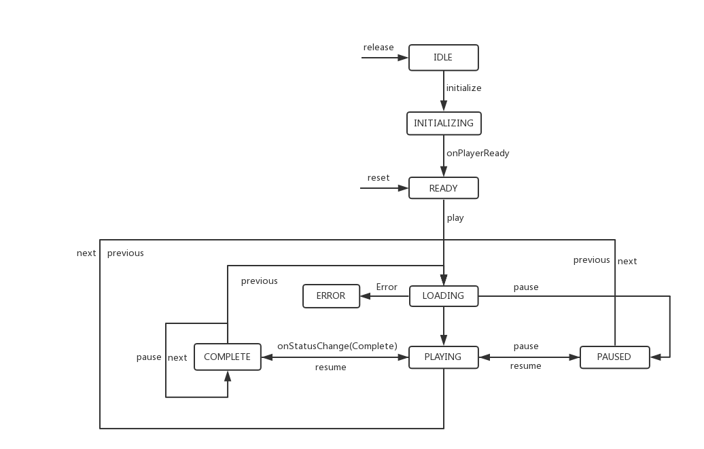

# AIUIPlayer

AIUIPlayer是用于解析播放AIUI语义结果中音频资源的播放器。

## 1. 问题

AIUI语义结果的音频资源在升级后不再直接返回可播放的音频URL，而是需要依用对应信源方的SDK才能解析播放。

举个例子，故事技能在未升级前返回结果如下：

``` json
{
	"category": "改变世界100年心灵童话",
	"name": "学习害怕",
	"playUrl": "http://od.open.qingting.fm/vod/00/00/0000000000000000000025243697_64.m4a?u=786&channelId=94688&programId=2444135",
	"series": "学习害怕",
	"status": "1"
}
```

改变后的结果：

``` json
{
	"category": "改变世界100年心灵童话",
	"name": "学习害怕",
	"resourceId": "94688,2444135",
	"series": "学习害怕",
	"source": "qingtingfm",
	"status": "1"
}
```

音频资源不再直接返回可播放的url，而是通过新增的source字段指明信源，resourceId提供特定于信源方的音频信息。

上面这条结果，qingtingfm表明信源方是蜻蜓FM，而resourceId就是"channelId, programId"。蜻蜓FM的SDK中的QTPlayer播放器提供了prepare(channelId, programId)接口播放此类资源。

## 2. 解决办法

AIUIPlayer为开发者提供了统一的播放和控制接口，在内部根据音频资源的source字段，调用不同信源方的SDK进行实际的播放和控制。

## 3. 使用方法

### 3.1 项目配置

在顶层目录下的build.gradle中加入jitPack仓库和蜻蜓FM的maven仓库

``` groovy
allprojects {
    repositories {
        ......
        maven {
            url uri('https://jitpack.io')
        }

        maven {
            url uri('http://maven.qingting.fm/')
        }
    }
}
```

在app下的build.gradle加入AIUIPlayer的依赖

``` groovy
dependencies {
    ......
    implementation 'com.github.pangxiezhou.AIUIPlayer:player_core:0.3'
}
```

### 3.2 接口调用

``` kotlin
    player = AIUIPlayer(this)
    player.addListener(object : PlayerListener {
        override fun onPlayerReady() {
            titleTxt.text = "初始化成功"
            startPlaySamples()
        }

        override fun onStateChange(state: PlayState) {
            when (state) {
                PlayState.PLAYING -> ToggleBtn.text = "暂停"
                PlayState.PAUSED -> ToggleBtn.text = "继续"
            }
        }

        override fun onMediaChange(item: MetaInfo) {
            //根据播放项变化回调修改title内容
            titleTxt.text = item.title
        }

        override fun onPlayerRelease() {
            titleTxt.text = "未初始化"
        }

    })

    initializeBtn.setOnClickListener {
        player.initialize()
    }

    releaseBtn.setOnClickListener {
        player.release()
    }

    PreBtn.setOnClickListener {
            if (player.previous()) {
                Toast.makeText(this, "当前已是第一首", Toast.LENGTH_LONG).show()
            }
        }
```

更详细的调用参考sample目录下代码示例。

## 4. 状态参考

