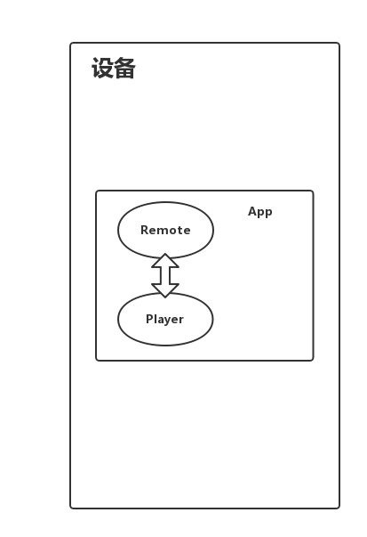
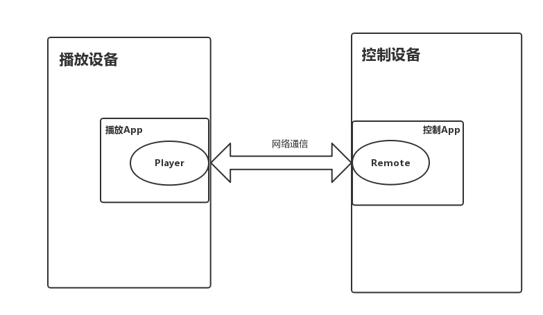

# AIUIPlayer

AIUIPlayer是用于解析播放AIUI语义结果中音频资源的播放器。

## 1. 问题

AIUI语义结果的部分信源的音频资源在升级后不再直接返回可播放的音频URL，而是需要依用对应信源方的SDK才能解析播放。

举个例子，故事技能在未升级前返回结果如下：

``` json
{
	"category": "改变世界100年心灵童话",
	"name": "学习害怕",
	"playUrl": "http://od.open.qingting.fm/vod/00/00/0000000000000000000025243697_64.m4a?u=786&channelId=94688&programId=2444135",
	"series": "学习害怕",
	"status": "1"
}
```

改变后的结果：

``` json
{
	"category": "改变世界100年心灵童话",
	"name": "学习害怕",
	"resourceId": "94688,2444135",
	"series": "学习害怕",
	"source": "qingtingfm",
	"status": "1"
}
```

音频资源不再直接返回可播放的url，而是通过新增的source字段指明信源，resourceId提供特定于信源方的音频信息。

上面这条结果，qingtingfm表明信源方是蜻蜓FM，而resourceId就是"channelId, programId"。蜻蜓FM的SDK中的QTPlayer播放器提供了prepare(channelId, programId)接口播放此类资源。

## 2. 解决办法

AIUIPlayer为开发者提供了统一的播放和控制接口，在内部根据音频资源的source字段，调用不同信源方的SDK进行实际的播放、授权和控制。

目前播放支持：

- 蜻蜓FM
- 酷狗音乐
- 直接URL资源


### 2.1 模块介绍

root

​	sample_player   // 播放器示例

​	sample_remote  // 控制器示例

​	sub_modules

​		common // 公共依赖

​		player // 播放器

​		remote //控制器

​		thirdparty-players // 第三方SDK播放器依赖


### 2.2 控制器

调用AIUIPlayer播放资源时，内部其实调用的是第三方SDK进行播放，而第三方SDK播放器（如酷狗）在播放前需要用户进行登录授权。

通过集成remote模块即可处理登录授权的请求。player模块在播放到需要授权的资源时将授权请求发送到remote模块，remote模块弹出对应授权界面，用户输入完成授权后将授权信息返回给player模块，player使用授权信息完成资源的继续播放。

player模块和remote模块可以集成在一个App内，该App既负责播放也负责授权，比较适用于手机App或者有屏的播放设备。




player模块和remote模块也可以集成在不同设备上，例如无屏音箱集成player模块，对应的音箱手机客户端集成remote模块，这种情况下remote模块在初始化时需要指定播放设备的IP地址。




## 3. 使用方法

### 3.1 项目配置

在顶层目录下的build.gradle中加入jitPack仓库和蜻蜓FM的maven仓库

``` groovy
allprojects {
    repositories {
        ......
        maven {
            url uri('https://jitpack.io')
        }

        maven {
            url uri('http://maven.qingting.fm/')
        }
    }
}
```

如果集成播放器，在app下的build.gradle加入player的依赖

``` groovy
dependencies {
    ......
    implementation 'com.github.pangxiezhou.AIUIPlayer:player:0.3'
}
```

如果集成控制器，在app下的build.gradle加入remote的依赖

```groovy
dependencies {
    ......
    implementation 'com.github.pangxiezhou.AIUIPlayer:remote:0.3'
}
```


### 3.2 接口调用

#### 3.2.1 player接口调用示例

``` kotlin
    player = AIUIPlayer(this)
    player.addListener(object : PlayerListener {
        override fun onPlayerReady() {
            titleTxt.text = "初始化成功"
            startPlaySamples()
        }

        override fun onStateChange(state: PlayState) {
            when (state) {
                PlayState.PLAYING -> ToggleBtn.text = "暂停"
                PlayState.PAUSED -> ToggleBtn.text = "继续"
            }
        }

        override fun onMediaChange(item: MetaInfo) {
            //根据播放项变化回调修改title内容
            titleTxt.text = item.title
        }

        override fun onPlayerRelease() {
            titleTxt.text = "未初始化"
        }
    })

    initializeBtn.setOnClickListener {
        player.initialize()
    }

    releaseBtn.setOnClickListener {
        player.release()
    }

    PreBtn.setOnClickListener {
            if (player.previous()) {
                Toast.makeText(this, "当前已是第一首", Toast.LENGTH_LONG).show()
            }
        }
```

更详细的调用参考sample_player目录下代码示例。


#### 3.2.1 remote接口调用示例

```kotlin
    PlayerRemote.init(context)
```


## 4. Player状态参考

